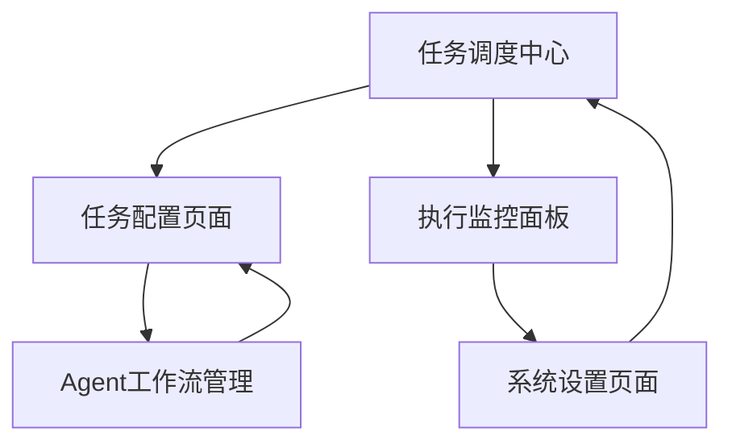

# AI Schedule MCP Tool - 产品需求文档

## 1. 产品概述

AI Schedule MCP Tool 是一个基于MCP协议的智能定时任务调度工具，专为IDE环境设计，能够自动化驱动AI Agent完成各种开发任务。

该工具解决了开发者需要手动触发重复性任务的痛点，通过智能调度和Agent协作，提升开发效率和代码质量。目标是成为开发团队不可或缺的自动化助手。

## 2. 核心功能

### 2.1 用户角色

| 角色 | 注册方式 | 核心权限 |
|------|----------|----------|
| 开发者 | IDE插件安装激活 | 创建和管理定时任务、配置Agent工作流 |
| 团队管理员 | 邀请码升级 | 管理团队任务、查看执行报告、配置全局设置 |

### 2.2 功能模块

我们的AI Schedule MCP Tool包含以下主要页面：

1. **任务调度中心**：任务列表展示、快速创建入口、执行状态监控
2. **任务配置页面**：定时规则设置、Agent选择配置、执行参数定义
3. **Agent工作流管理**：工作流模板库、自定义流程编辑、Agent能力配置
4. **执行监控面板**：实时执行日志、性能指标展示、错误告警处理
5. **系统设置页面**：MCP连接配置、IDE集成设置、通知偏好管理

### 2.3 页面详情

| 页面名称 | 模块名称 | 功能描述 |
|----------|----------|----------|
| 任务调度中心 | 任务列表 | 展示所有定时任务，支持状态筛选、搜索和批量操作 |
| 任务调度中心 | 快速创建 | 提供常用任务模板，一键创建新的定时任务 |
| 任务调度中心 | 状态监控 | 实时显示任务执行状态、成功率统计和异常提醒 |
| 任务配置页面 | 定时设置 | 支持Cron表达式、自然语言描述的灵活定时配置 |
| 任务配置页面 | Agent选择 | 从可用Agent列表中选择，配置执行参数和优先级 |
| 任务配置页面 | 执行环境 | 设置工作目录、环境变量和资源限制 |
| Agent工作流管理 | 模板库 | 预置常用工作流模板，如代码检查、自动测试、部署等 |
| Agent工作流管理 | 流程编辑器 | 可视化编辑工作流步骤，支持条件分支和循环 |
| Agent工作流管理 | Agent配置 | 管理Agent能力、权限和连接配置 |
| 执行监控面板 | 实时日志 | 显示任务执行的详细日志，支持日志级别筛选 |
| 执行监控面板 | 性能监控 | 展示CPU、内存使用情况和执行时间统计 |
| 执行监控面板 | 告警中心 | 配置告警规则，及时通知执行异常和性能问题 |
| 系统设置页面 | MCP配置 | 配置MCP服务器连接、认证信息和协议参数 |
| 系统设置页面 | IDE集成 | 管理IDE插件设置、快捷键和界面布局 |
| 系统设置页面 | 通知设置 | 配置邮件、Slack等通知渠道和消息模板 |

## 3. 核心流程

**开发者使用流程：**
用户首先在任务调度中心查看现有任务状态，然后通过任务配置页面创建新的定时任务，选择合适的Agent工作流，设置执行时间和参数。任务创建后，系统自动按计划执行，用户可在执行监控面板查看实时状态和日志。

**团队管理员流程：**
管理员通过系统设置页面配置全局参数和团队权限，在Agent工作流管理中创建和维护标准化模板，通过执行监控面板分析团队任务执行情况，优化工作流程。

## 4. 用户界面设计

### 4.1 设计风格

- **主色调**：深蓝色(#1e3a8a)作为主色，浅蓝色(#3b82f6)作为辅助色
- **按钮样式**：圆角矩形按钮，支持悬停和点击动效
- **字体**：主要使用Inter字体，代码区域使用JetBrains Mono，标题16px，正文14px
- **布局风格**：卡片式布局，左侧导航栏，顶部工具栏设计
- **图标风格**：使用Lucide图标库，简洁线性风格，支持主题色彩适配

### 4.2 页面设计概览

| 页面名称 | 模块名称 | UI元素 |
|----------|----------|--------|
| 任务调度中心 | 任务列表 | 表格布局，状态标签使用颜色编码，操作按钮右对齐 |
| 任务调度中心 | 快速创建 | 模态对话框，步骤式向导，进度指示器 |
| 任务配置页面 | 定时设置 | 标签页切换，Cron可视化编辑器，预览时间显示 |
| Agent工作流管理 | 流程编辑器 | 拖拽式节点编辑，连线动画，缩放和平移支持 |
| 执行监控面板 | 实时日志 | 虚拟滚动列表，语法高亮，自动刷新开关 |
| 系统设置页面 | 配置表单 | 分组折叠面板，表单验证提示，保存状态反馈 |

### 4.3 响应式设计

产品采用桌面优先设计，针对1920x1080及以上分辨率优化。支持平板设备适配，在小屏幕上自动折叠侧边栏，调整表格为卡片布局。考虑触摸交互优化，增大点击区域，支持手势操作。